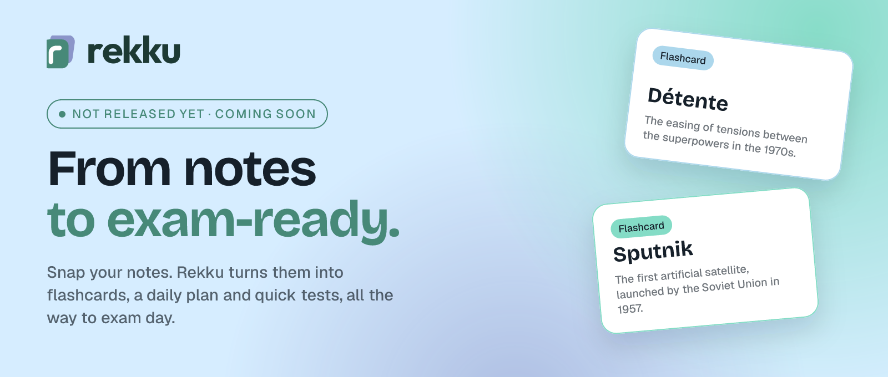
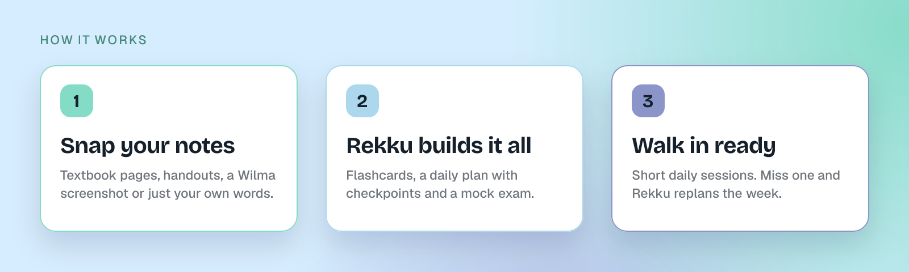

<picture>
  <source media="(prefers-color-scheme: dark)" srcset="assets/hero-dark.png">
  
</picture>

  
  
  

  <a href="https://rekku.net"><b>rekku.net</b></a> &nbsp;·&nbsp;
  <a href="mailto:contact@rekku.net">contact@rekku.net</a>

 

> [!NOTE]
> **Rekku isn't out yet.** We're building the app right now. Follow along at [rekku.net](https://rekku.net) to hear when it launches.

## Your all-in-one study suite

Rekku is an AI study app for students. Tell it what's on the test, add photos of your textbook, a Wilma screenshot, your handouts or just explain it in your own words. Rekku works out what the exam covers and builds everything you need to get there.

<picture>
  <source media="(prefers-color-scheme: dark)" srcset="assets/how-it-works-dark.png">
  
</picture>

## What's inside

<table>
  <tr>
    <td width="50%" valign="top">
      <h3>🃏 Flashcards</h3>
      Swipe right if you know it, left if you're still learning. Sets are made for you from your material, and you can edit every card.
    </td>
    <td width="50%" valign="top">
      <h3>🎯 Practice</h3>
      Miss one and it comes back until you've got it. No score, no pressure, and a typo won't count against you.
    </td>
  </tr>
  <tr>
    <td valign="top">
      <h3>🗓️ Study guides</h3>
      Your exam split into short daily sessions. Tick off the steps, pass the checkpoint, done for the day. Tell Rekku "I have football on Wednesdays" and it replans the week.
    </td>
    <td valign="top">
      <h3>📸 Snap your notes</h3>
      Take a photo of your notebook, a textbook page or the whiteboard. Rekku reads it and builds the flashcards, plan and tests.
    </td>
  </tr>
  <tr>
    <td valign="top">
      <h3>🧠 Recall</h3>
      Flashcards teach you the words. Recall teaches you the ideas behind them, checks you really get them and shows how topics connect.
    </td>
    <td valign="top">
      <h3>📝 Mock exam</h3>
      A practice exam built from your material, with brand new questions every time. You can't memorise the answers, you have to actually know it.
    </td>
  </tr>
  <tr>
    <td valign="top">
      <h3>💬 Ask Rekku</h3>
      One chat per exam that knows your material, answers with the page it came from, and fixes things when you spot a mistake.
    </td>
    <td valign="top">
      <h3>🤝 Study together</h3>
      Share an exam or a single set with your class. It's live, not a copy, so when you fix a card it's fixed for everybody.
    </td>
  </tr>
</table>

## Built for students

- 🇫🇮 **Made in Finland**, for Finnish schools first. Works with Finnish, Swedish, English and the other languages you study.
- ✋ **You stay in control.** Everything Rekku makes can also be made and edited by hand, and its changes come with an Undo.
- 🔒 **Privacy first.** Many of our users are under 18. We collect as little as we can, and you can delete your account right in the app.

## Built with

  
  
  
  
  
  
  

 

  © 2026 Rekku · <a href="https://rekku.net">rekku.net</a> · <a href="https://rekku.net/privacy">Privacy</a> · <a href="https://rekku.net/terms">Terms</a>

